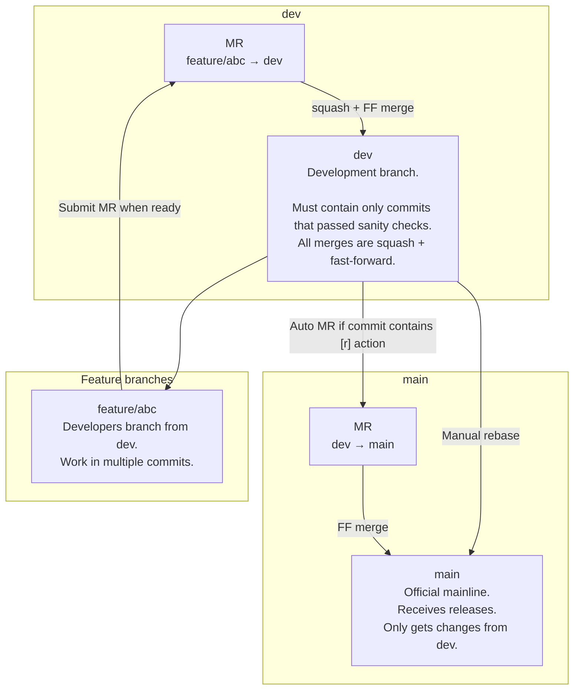

# Development Process

This document describes the workflow used in the repository, including branching conventions, merge rules, and release flow.

---

## 1. Branch Structure



### **main**
- The official mainline.
- Contains only stable and released code.
- Receives changes **only** from the `dev` branch.
- Merges from`dev` into `main` may happen:
  - **Manually**, or
  - **Automatically**, if a commit merged into `dev` contains `[r]` in the commit title.

### **dev**
- The branch for continuous, validated development.
- **Only allowed to contain commits that have passed sanity checks.**
- Developers do not commit directly to `dev`.  
  All changes arrive via Merge Requests from feature branches.

### Feature branches
- Named arbitrarily by developers (e.g., `feature/foo`, `fix/bar`).
- Always branch off from `dev`.
- Developers may commit freely here.

---

## 2. Development Workflow

1. **Create a feature branch**
   ```sh
   git checkout dev
   git pull
   git checkout -b feature/my-feature

---

## 3. CI/CD

| Event / Branch       | verify | build | test | autotag | docs | release    |
| -------------------- | ------ | ----- | ---- | ------- | ---- | ---------- |
| **push → main**      | ✅      | ✅     | ✅    | ❌       | ✅    | ❌/✅ optional |
| **PR → main**        | ✅      | ✅     | ✅    | ❌       | ❌    | ❌          |
| **push → dev**       | ✅      | ✅     | ✅    | ✅       | ❌    | ❌          |
| **PR → dev**         | ✅      | ✅     | ✅    | ❌       | ❌    | ❌          |
| **push → any other** | ❌      | ✅     | ✅    | ❌       | ❌    | ❌          |
