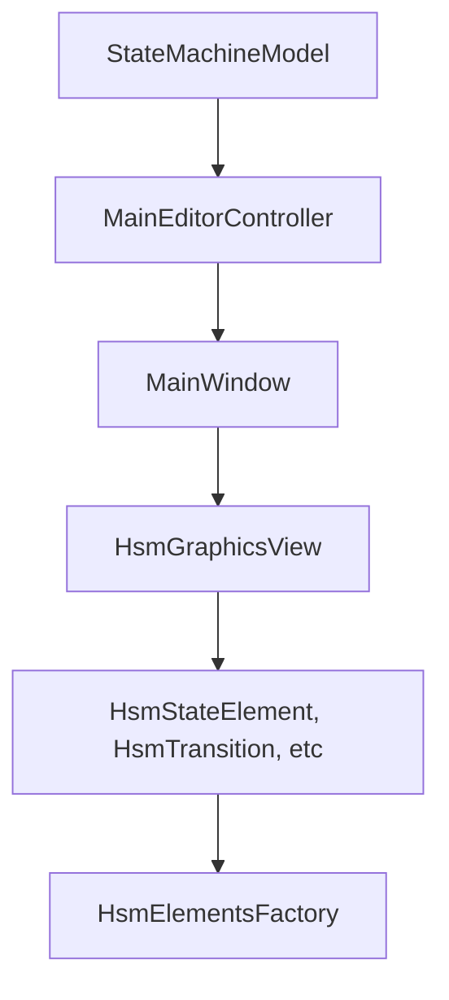

# System Patterns

## Architecture Overview
- Model-View-Controller (MVC) architecture with clear separation
- Model: StateMachineModel and element classes
- View: Qt-based UI components and graphics view
- Controller: Mediates between model and view

## Key Technical Decisions
- C++ as primary implementation language
- Qt framework for cross-platform GUI development
- CMake for build system management
- Git for version control

## Design Patterns
- Factory pattern (HsmElementsFactory)
- State pattern (StateMachineElement hierarchy)
- Observer pattern for model-view synchronization
- Command pattern for undo/redo functionality

## Component Relationships

## Critical Implementation Paths
- State machine element creation via factory
- Transition handling between states
- Serialization/deserialization of state machines
- Undo/redo stack implementation
